Creado por Ángel Eduardo Urueta Puello
A01796724 MNA - Tecnológico de Monterrey

### PASOS PARA CORRER EN MAC

a.	Instalación de librería OPENMP para Mac:

  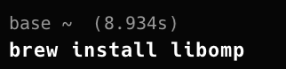

  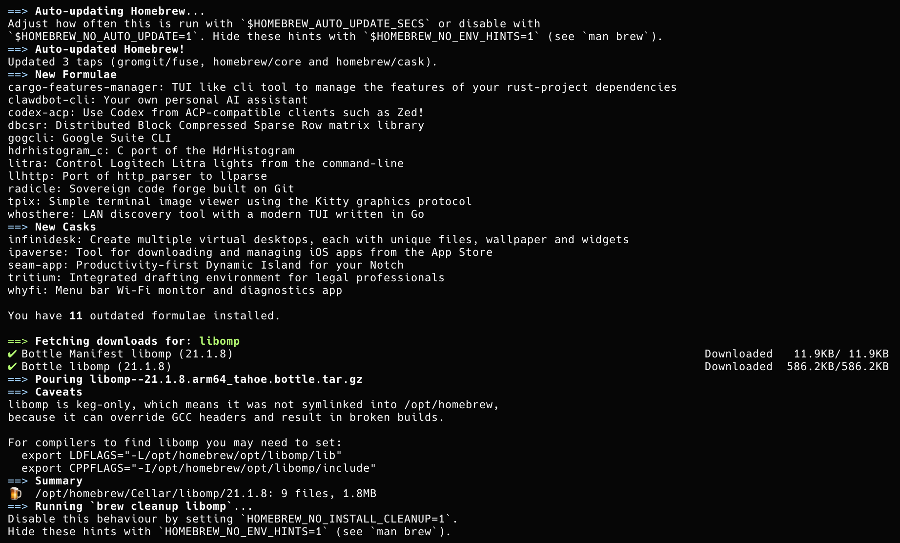

 

b.	Instalación de compilador:

  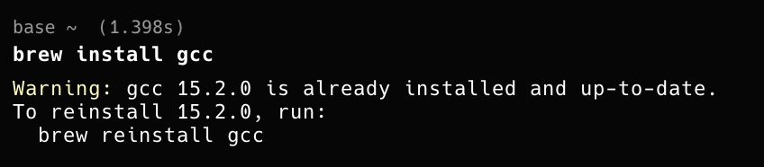

c.	Programa de prueba:

  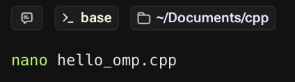

  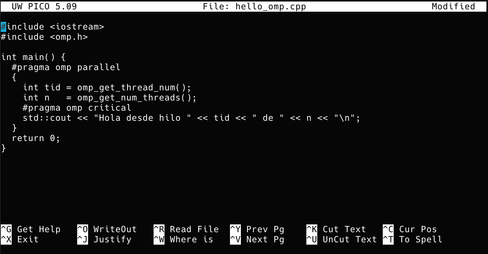

d.	compilación programa de prueba:

  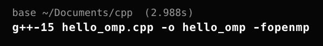

e.	Ejecución programa de prueba (Procesador M2 con 8 núcleos): 

  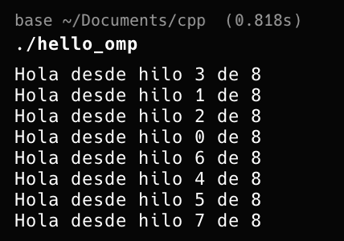

  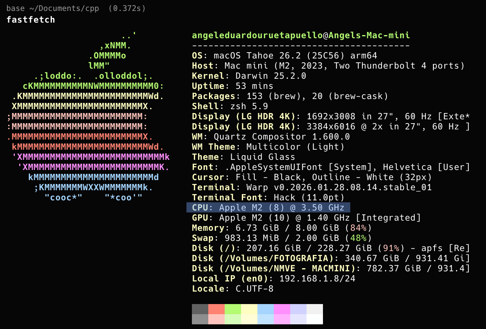

f.	Escritura del programa suma de arrays (aquí cambié el tamaño de los arrays y la cantidad de datos a mostrar solo por probar):

  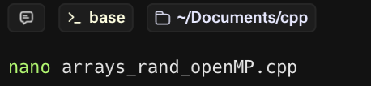

  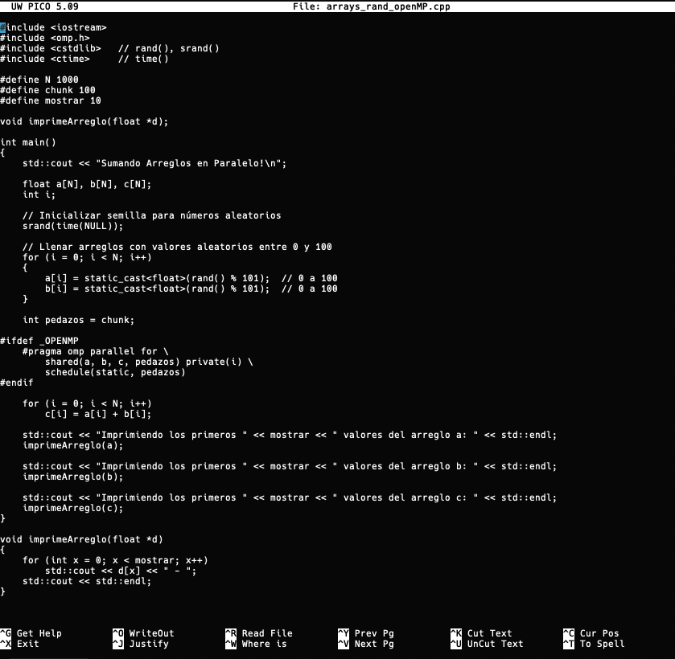

g.	Compilación:

  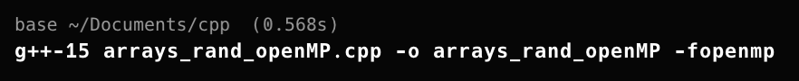

h.	Ejecución:

  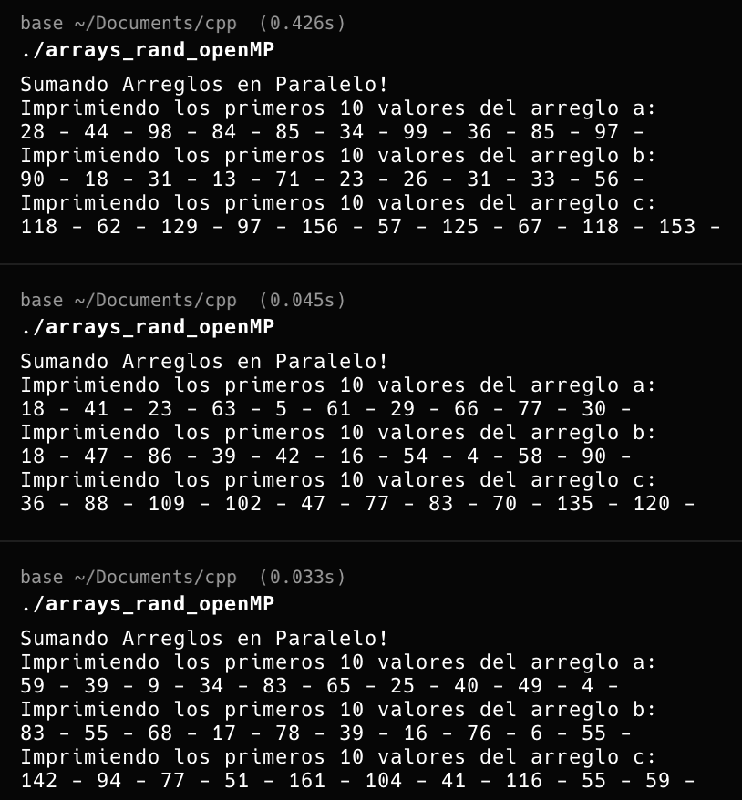

